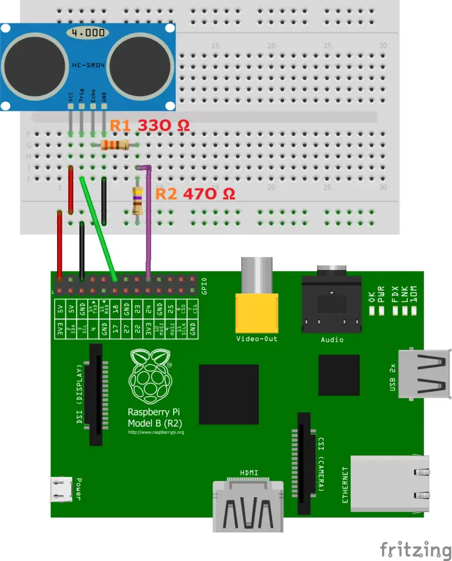

# Electronics

We haven't bothered to create any nice sketches or drawings of our circuits. They are all quite trivial and there wasn't much time anyway. The connections of the ultrasonic sensors are interesting:

{width=40%}

Source: https://tutorials-raspberrypi.de/entfernung-messen-mit-ultraschallsensor-hc-sr04/

We changed the 470 Ohms resistor to a 10k Ohms resistors which is said to work better.

The LEDs are connected to the Raspberry Pi GPIO pins with appropriate 220 Ohms resistors. The buttons are also connected to GPIO pins with configured pull-ups.

The rest is described in the project reports, which is also where you can find our component list.
