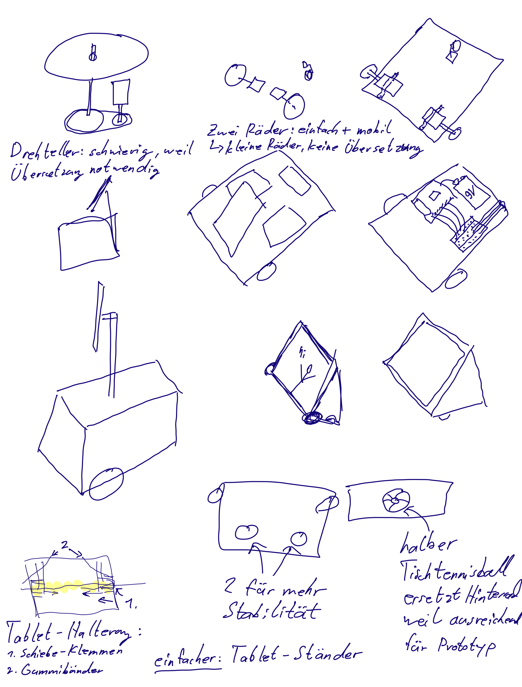
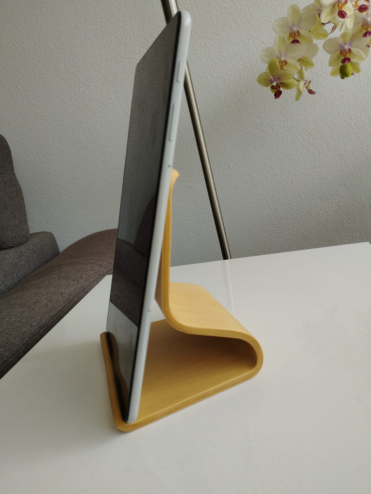
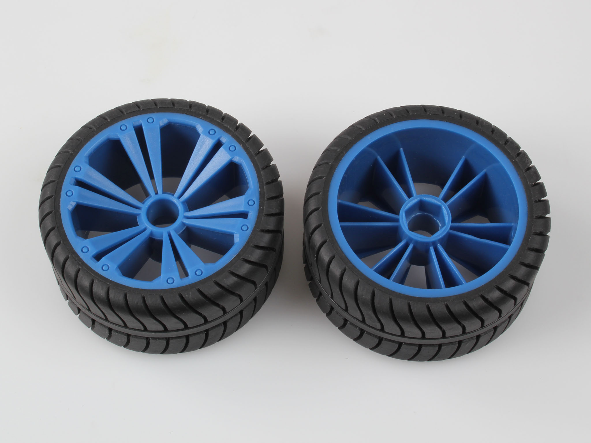
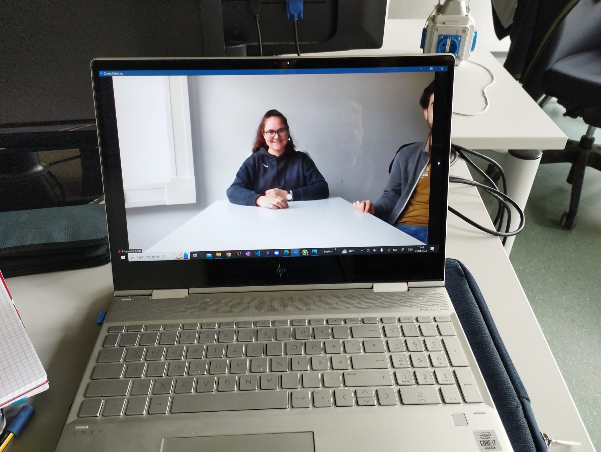

# PhysComp SS23 Group 09 - Week 03

## Progress Report

### What we achieved this week

#### First Concept

We brainstormed on the rough design and came up with a solution that should be feasible on the technical side. We then refined our idea to a more user friendly and convenient concept. We drew some first sketches on what the device could look like and then created storyboards with a short description of the use cases explaining the functionality. We also wrote down the requirements.

#### Sketches

#### Requirements

- The target group is
  - device user: people participating in video conferences, in possession of a smartphone or tablet
  - remote user: people participating in video conferences, in possession of a laptop or desktop computer
- The device can hold a smartphone or a tablet and use its camera for the video call
- The device has motors for the movement of the wheels and the device
- The device can be controlled by another person in the video call with their keyboard using the up-, down-, right- and left-arrow keys
- The device uses (in the automatic mode) face tracking to follow the person on the screen 
- The device moves fast and precise enough
- The device is battery-powered

#### Sample the world
We collected pictures from the real world related to our topic. The smartphone holder and wheels are objects that can be combined for our device. The office conference and kitchen are scenarios in which our device could be helpful.

##### Smartphone holder

##### Wheels

##### Office Conference Scenario: One participant is only partly visible

##### Kitchen scenario: Videocall

### What we could not achieve this week

Nothing. 

### What we plan to do for the coming week

We want to evaluate if our ideas are appropriate. We also want to work on the paper prototype, write a component list and think of milestones.
