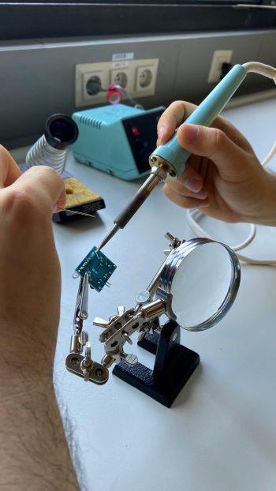
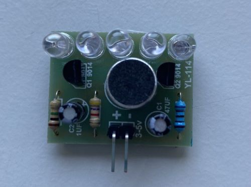

# PhysComp SS23 Group 09 - Week 08.md

## Soldering Exercise
Report on your soldering exercises (pictures/videos and text). What was your experience, what *challenges* did you face, what was the *outcome*?

### Challenges  

The main challege was to get the solder heated up at the right position, because not all sides of the soldering iron were hot. So it sometimes took a little patience or a new position of the soldering iron until the wire could be soldered. We used the helping hand and a flux pen, that helped the solder flow cleanly onto the parts we were soldering.
Another challenge was to reach the position between all the wires, but the helping hand and cutting and bending the finished wires away helped a lot and all in all we are satisfied with the result. 

Here are some pictures of us soldering: 

{width=40%}

{width=40%}

### Outcomes 
Our outcome is a very nice littel LED Orgel that lights up when the microphone detects a sound.

## Weekly Progress Report

What have you achieved this week with regards to your project? As usual, if your *concept* has changed, briefly describe this (and post pictures). Also, report on your progress in *developing your prototype* or *acquiring equipment*.

### What we achieved this week

### What we could not achieve this week

### What we plan to do for the coming week
