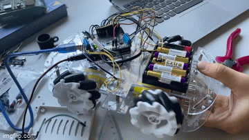

# PhysComp SS23 Group 09 - Week 09

## Progress Report

### What we achieved this week

#### Arduino Motor test
We decided that it is easiest to use the motor shield with our Arduino since it is designed to work with it. We still need the Raspberry Pi for the image processing, though. So our project will use both an Arduino and a Raspberry Pi.

We mounted the motor shield onto the Arduino. This was easy, because we had desoldered many unnecessary wires a few weeks prior. A problem was, that a poorly soldered pin had a connection issue, but with some pushing and pulling, it is solved for now. We might want to re-solder the pin if the problem arises again. We then ran the example code for the motor shield as a test.

{width=60%}

#### Raspberry Pi
In order to get the Raspberry Pi working, we borrowed an SD reader from another group (we expected the Uni to at least have a microSD-SD adapter, but there was none to be found). We then installed a Raspbian Lite image onto our microSD card and configured it to connect to connect to my Laptop via WLAN. After a bit of troubleshooting, everything worked fine. We then tried connecting the Raspberry Pi to the Arduino via USB, but there seems to be some issue with the serial port configuration on the Pi. We have to look into that next week.

We also decided to use the Raspberry Pi camera module which we found in a box in the HCI lab. This way, our system can operate independently from the tablet, making it much simpler and hopefully more robust. We have to figure out where to mount the camera.

#### Building the physical parts
We created plans with proper measurements for the base that connects the tablet holder to the omni wheel platform. Unfortunately, we forgot to take pictures. We gave the plans and some wood scrap to the engineering services and hop to receive our parts in the next few weeks.

We also 3D printed our front panel. It came out exactly as expected.

{width=40%}
{width=40%}

### What we could not achieve this week

* Construction plan for the top part (including spot for the Raspberry Pi camera)
* Plan for mounting the ultrasonic sensor
* Raspberry Pi to Arduino connection

### What we plan to do for the coming week

* Plan the the top part, camera and ultrasonic sensor placement (reach Milestone 1)
* Hopefully receive parts from the engineering services, work on the top part (toward Milestone 2)
* Connect Raspberry Pi to Arduino for motor controls, test the camera (toward Milestone 3)
