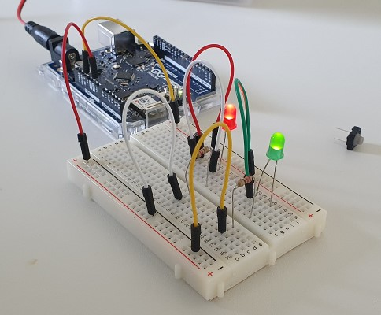

# PhysComp SS\<23\> Group \<09\> - Week \<01\>

## Progress Report

### What we achieved this week

What goals did you reach this week? What progress did you make in your project? Add pictures, screenshots, or videos of
the things you did (`Weekly Reports/Figures`). Include media inline in Markdown when possible:

### What we could not achieve this week

It's no shame talking about what you could not achieve. Why did you fail to miss your goals? How would you do it
different next time?

### What we plan to do for the coming week

Make a plan what you want to do until the next assignment.

## Add sections as you see fit for the assignment

Some weekly assignments contain other tasks like creating a order list. You can create the subsections as you see fit 
for the assignment.
